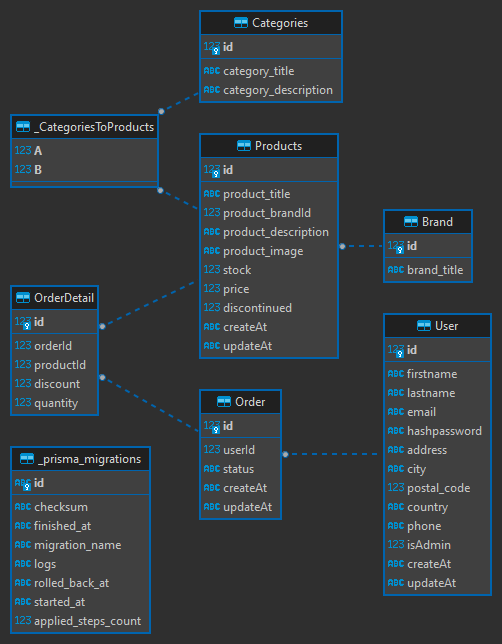

# Store Web Application 
Hello, In this project we're gonna create a **REST API**  with Fastify as a web framework and using a Prisma as an ORM ( Object Relational Mapping )

## What stack am I using?
- [Fastify](https://www.fastify.io/) - web framework
- [Prisma]() - Database ORM (Object Relational Mapping)

## Database Diagram
